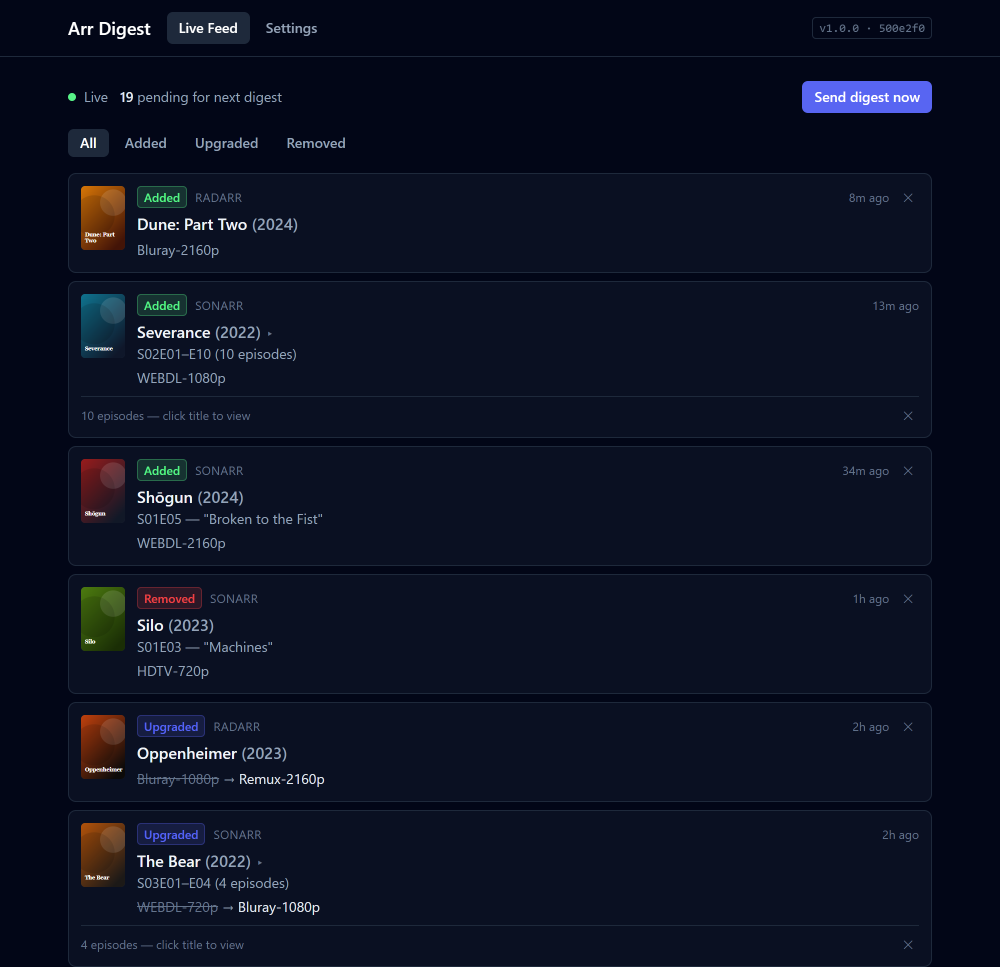
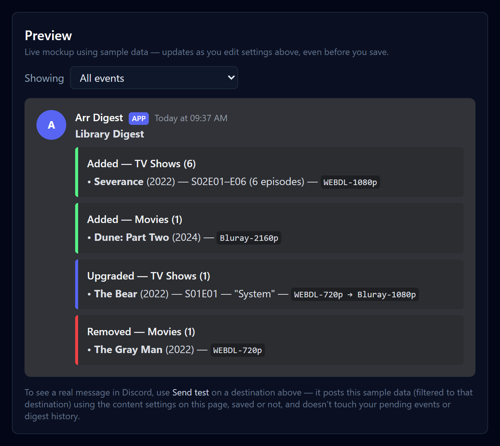
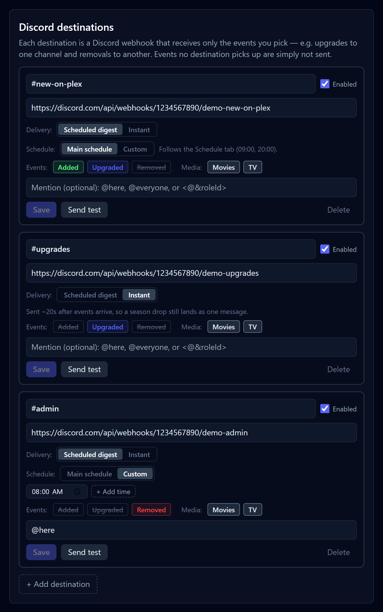
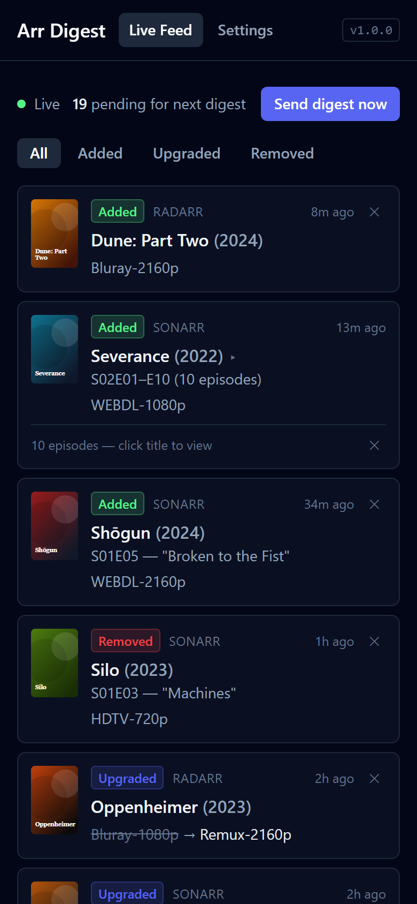

# Arr Digest

A self-hosted digest bot for Sonarr and Radarr. It listens for their webhook
notifications, tracks additions/upgrades/removals as they happen, shows them
live in a web UI, and posts a scheduled summary to Discord.

Removals caused by an upgrade (the old file being replaced by a better one)
are automatically suppressed so they don't also show up as a "removed" item —
only genuine deletions (manual, missing from disk, etc.) are reported as
removals.

The web UI is protected by a username and password you create on first
launch (optionally skipped for devices on your home network). See
[Security](#security).



<table>
  <tr>
    <td width="40%" valign="top">
      
      <br><sub>Live preview of the Discord message as you change settings</sub>
    </td>
    <td width="34%" valign="top">
      
      <br><sub>Different events to different channels, scheduled or instant</sub>
    </td>
    <td width="26%" valign="top">
      
      <br><sub>Works on a phone, and installs as an app</sub>
    </td>
  </tr>
</table>

<sub>Screenshots use demo data.</sub>

## How it works

- Sonarr/Radarr are configured with a **Webhook** connection pointing at this
  app. On import, delete, or upgrade, they POST an event here in real time.
- Events are normalized, stored in SQLite, pushed to any open **Live Feed**
  page over WebSocket, and queued for the next digest.
- On a schedule you configure (one or more times a day, in your timezone),
  the queued events are grouped into Discord embeds and sent to one or more
  Discord webhooks ("destinations"), each receiving only the event types it's
  subscribed to. You can also trigger a send immediately from the Live Feed
  page.

## Stack

- Backend: Node.js + TypeScript, Fastify, better-sqlite3 via Drizzle ORM,
  `croner` for scheduling.
- Frontend: React + TypeScript + Vite + Tailwind.
- Single Docker image serves the built frontend and the API together.

## Local development

Requires Node 22+.

```bash
npm install
npm run dev
```

This runs the Fastify API on `:8080` and the Vite dev server (with API/WS
proxying) on `:5173`. Open `http://localhost:5173`.

The SQLite database is created at `server/data/digest.sqlite` on first run.

Run the tests with `npm test`. They cover webhook normalization (including
upgrade-delete suppression), message building and season grouping, and
delivery routing/failure handling against a throwaway database and a mock
Discord endpoint — they never touch `server/data` or real Discord. The
Docker build runs them too, so a failing test stops the image from being
built.

## Running in Docker

Images are published to GitHub Container Registry for amd64 and arm64:

| Tag | What it is |
|-----|------------|
| `ghcr.io/ethanetxyz/arr-digest:latest` | Latest release |
| `…:1`, `…:1.0`, `…:1.0.0` | Pinned to a major / minor / exact release |
| `…:edge` | Latest commit on `main` — may be unstable |

With Docker Compose, using [docker-compose.yml](docker-compose.yml) from
this repo:

```bash
docker compose up -d
```

Or with plain Docker:

```bash
docker run -d --name arr-digest --restart unless-stopped \
  -p 8080:8080 -v "$PWD/data:/app/data" \
  ghcr.io/ethanetxyz/arr-digest:latest
```

Either way it listens on port `8080` and keeps its SQLite database in
`./data`. To build the image yourself instead, see the comment in
`docker-compose.yml`.

## Running on Unraid

1. **Add the template.** Open a terminal on Unraid (the Web Terminal in the
   top bar, or SSH) and run:

   ```bash
   wget -O /boot/config/plugins/dockerMan/templates-user/my-arr-digest.xml \
     https://raw.githubusercontent.com/EthanetXYZ/arr-digest/main/my-arr-digest.xml
   ```

2. Go to **Docker → Add Container**, and pick **arr-digest** from the
   **Template** dropdown.
3. Check the **Data** path (defaults to `/mnt/user/appdata/arr-digest`) and
   **WebUI Port** (defaults to `8080`), then **Apply**. Unraid pulls the
   image and starts it.
4. Open the container's WebUI, create your login, and continue with
   **Setup** below. Use your Unraid server's LAN IP as the **Public URL** in
   Settings so the webhook URLs Sonarr/Radarr get are correct.

Updates then work like any other container: when a new release is out,
the Docker tab shows **update ready** — click it and choose **apply
update**.

Environment variables (all optional):

| Variable   | Default          | Purpose                                  |
|------------|------------------|-------------------------------------------|
| `PORT`     | `8080`           | HTTP port                                 |
| `HOST`     | `0.0.0.0`        | Bind address                              |
| `DATA_DIR` | `/app/data`       | Where the SQLite file is stored           |
| `TZ`       | container default | Host timezone (digest scheduling uses the timezone you set in-app, not this) |

All other configuration — Discord destinations, digest schedule, display
options — is done through the web UI, not environment variables, so it can
be changed without restarting the container.

## Setup

### 1. Open the web UI, create your login, and go to Settings

It's at `http://<host>:8080` (or `:5173` in dev). The first visit asks you
to create a username and password — do this straight away, since until
you do, whoever opens the page first gets to pick them.

The **Settings** page shows two webhook URLs, one for Sonarr and one for
Radarr, each with a unique token baked in. Sonarr/Radarr don't log in, so
this token is what keeps random requests on your network from injecting
fake events.

> Copy these URLs using the address your Sonarr/Radarr containers can
> actually reach (e.g. the Docker host's LAN IP), not `localhost`, if they
> run in separate containers.

### 2. Add the webhook to Sonarr and Radarr

In each app: **Settings → Connect → Add → Webhook**

- **URL**: paste the corresponding URL from this app's Settings page
- **Method**: `POST`
- **Triggers**: enable **On Import**, **On Upgrade**, and **On File Delete**
  - `On Upgrade` is a separate trigger from `On Import`, not implied by it —
    without it, Sonarr/Radarr never sends the event at all when a file is
    replaced by a better one, so upgrades silently vanish.
  - `On File Delete for Upgrade` is *not* needed. This app already learns
    about the replaced file from the paired Upgrade event, and deliberately
    ignores the delete-for-upgrade event so it isn't double-counted as a
    removal.
  - Other triggers (On Grab, On Rename, etc.) are ignored by this app —
    fine to leave them off.

Use the **Test** button in Sonarr/Radarr to confirm connectivity — it should
return success immediately without creating any events.

### 3. Add Discord destinations

In Discord: **Server Settings → Integrations → Webhooks → New Webhook**,
pick the channel, and copy the webhook URL. In this app's Settings page,
under **Discord destinations**, click **Add destination** and paste it in.

Each destination picks which events it receives (Added / Upgraded /
Removed) and which media (Movies / TV), plus an optional mention. To send
upgrades to one channel and removals to another, create one destination
per channel. Event types no enabled destination picks up aren't sent at
all, which is also how you turn a type off entirely. Use **Send test** on
a destination to post sample data to that channel.

Each destination's **Delivery** is either **Scheduled digest** (sent at the
digest times) or **Instant** (pushed as events arrive). Instant waits until
events have been quiet for 20 seconds (2 minutes at most) before sending,
because a season import arrives as one webhook per episode — this way it
still lands as a single "S01E01–E10" message rather than ten. An event that
only instant destinations want leaves the Live Feed once pushed, since it
won't be in the next digest.

A scheduled-digest destination follows the main send times (Schedule tab)
unless you give it its own under **Schedule → Custom** — e.g. removals once
in the morning, everything else in the evening. Custom times use the main
timezone, and the **Enable scheduled digests** switch pauses them too.

Each destination tracks what it has already received, so an item can go to
one channel at 9am and another at 8pm. If a destination's send fails, only
that destination retries it on its next run — the others never get
duplicates — and the failure shows as a banner on the Live Feed. An item
leaves the queue once every destination that wants it has received it, so
a destination that stays broken holds its items until you fix or disable
it.

### 4. Configure the schedule and display options

Also on the Settings page: send times (you can add more than one per day),
timezone, whether to group Movies/TV separately, compact vs. one-embed-per-item
display, and whether to skip sending when there's nothing to report.

The digest title can include counts, filled in for each message (so each
destination's digest counts only what it received):

| Variable | Counts |
|----------|--------|
| `{count}` | Every item in the message |
| `{added}`, `{upgraded}`, `{removed}` | Items of that kind |
| `{movies}` | Movies |
| `{shows}` | Different TV shows |
| `{episodes}` | Individual episodes |
| `{added_movies}`, `{removed_episodes}`, … | `movies`, `shows` or `episodes` of one kind (`added_`, `upgraded_` or `removed_`) |

- **Pluralising:** add a word after a colon. `{added:item} added today`
  becomes "3 items added today" or "1 item added today". For irregular
  plurals, give both forms: `{count:entry|entries}`.
- **Lists:** put several in one pair of braces and zeros are left out:
  `{added_movies:movie, added_episodes:episode}` becomes "2 movies & 7
  episodes", or just "7 episodes" when no movies were added.
- **Agreement:** `{was|were}` (or `{is|are}`, `{has|have}`, …) picks the
  first form after a count of exactly one thing, otherwise the second:
  `{added:item} {was|were} added` → "1 item was added" / "3 items were
  added".
- **Nothing to say:** if every count in the title is zero, the title is
  left off (the message still goes out if it has other content — e.g.
  removals under an "added" title).

Use the `added_` forms for titles about additions — plain `{movies}`
counts removed and upgraded movies too. A season batch counts as one item
everywhere — in the title, the section headers, and the Live Feed's
pending count.

## Live Feed

The home page shows events as they arrive from Sonarr/Radarr in real time,
with a running count of what's queued for the next digest, and a "Send
digest now" button to trigger an out-of-schedule send.

## Security

The web UI and its API need a login: one username and password, created on
first launch and changeable under **Settings → Security**. Passwords are
stored as scrypt hashes; sessions last 30 days from last use, and changing
the password signs out every other browser.

Under **Settings → Security → Who needs to log in** you can choose:

- **Always require login** (default).
- **Not required on my local network** — like Sonarr's "Disabled for Local
  Addresses". Requests straight from a private address (192.168.x.x,
  10.x.x.x, 172.16–31.x.x, localhost) get in without a login. Anything that
  arrives through a reverse proxy or tunnel (it has an `X-Forwarded-For`,
  `Forwarded`, `X-Real-IP` or `CF-Connecting-IP` header) still has to log
  in, even though the proxy itself is on your LAN.

Not behind the login:

- `/api/webhooks/sonarr` and `/api/webhooks/radarr` — Sonarr/Radarr can't
  log in, so these check the random token in the URL instead. Treat those
  URLs like a password. The token is masked in the server's logs, so
  `docker logs` output is safe to share.
- `/api/health` — for Docker's health check; reports only status and
  version.

Other protections: failed logins are limited to 10 per 15 minutes per
address; state-changing API calls need an `X-Requested-With: arr-digest`
header, which blocks cross-site request forgery; and the live feed's
WebSocket only opens with a single-use ticket.

The login is a sensible baseline, not a hardened internet-facing service.
For access from outside your home, a VPN (Tailscale, WireGuard) is the
safer choice. If you do expose it, put it behind a reverse proxy with HTTPS
(the session cookie is then marked `Secure` automatically) and, ideally,
its own authentication (Authelia, Authentik).

### Forgot your password

Remove the login, then open the web UI and create a new one. Settings,
destinations and history are kept.

```bash
docker exec arr-digest node server/dist/cli/reset-auth.js
```

When running from source instead: `npm run reset-auth`.

## License

[MIT](LICENSE)
